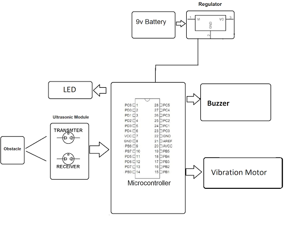

# Ultrasonic Object Detection Glove

A wearable smart glove project using an **ultrasonic sensor**, **vibration motor**, and **buzzer** built with **Arduino Uno** to help visually impaired individuals detect obstacles through tactile and auditory feedback.

---

## 📌 Project Highlights

- Detects objects up to 2 meters using HC-SR04 ultrasonic sensor
- Activates vibration and buzzer if object is closer than 100 cm
- Compact, wearable, and low-cost prototype
- Ideal for assistive navigation or obstacle-avoidance systems

---

## 🔧 Components Used

| Component               | Quantity | Description                       |
|------------------------|----------|-----------------------------------|
| Arduino Uno            | 1        | Microcontroller board             |
| HC-SR04 Ultrasonic Sensor | 1      | Distance measurement              |
| Vibration Motor        | 1        | Tactile feedback output           |
| Buzzer                 | 1        | Audio feedback output             |
| Glove                  | 1        | Wearable base                     |
| Jumper Wires           | As needed | Electrical connections           |
| Breadboard (Optional)  | 1        | Prototyping base (optional)       |

---

## 🔌 Pin Configuration

| Module           | Arduino Uno Pin |
|------------------|------------------|
| HC-SR04 Trigger  | D11              |
| HC-SR04 Echo     | D10              |
| Vibration Motor  | D7               |
| Buzzer           | D8               |
| VCC/GND          | 5V / GND         |

---

## 🧠 How It Works

The glove constantly checks for objects using the ultrasonic sensor:

- If an object is detected within **100 cm**, the **vibration motor** and **buzzer** are activated.
- If no object is nearby, the feedback is off.

This helps the user **feel and hear** the presence of obstacles, enabling safer navigation.

---

## 🖼️ Visuals

### 🔌 Circuit Diagram  

### 🧩 Block Diagram  

### 🧤 Working Prototype  

---

## 🧪 Getting Started

1. Install **NewPing** library in Arduino IDE
2. Wire components as per the circuit diagram
3. Open and upload `ultrasonic_glove_full.ino` from `/code/` folder
4. Use Serial Monitor (9600 baud) to see distance readings

---

## 🎯 Applications

- Navigation aid for visually impaired users
- Proximity detection for robotics
- Smart wearable safety equipment

---

## 📃 License

This project is licensed under the [MIT License](LICENSE).

---

## 👤 Author

**Tushar Prajapati**  
*Guided by Prof. Bhavin Mehta*  
Department of Biomedical Engineering  
LD College of Engineering, Ahmedabad

---

> 📌 For improvements or suggestions, feel free to open a pull request or fork this repo!

